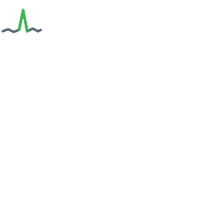

<p align="center">
  
</p>

<h1 align="center">flaketrace</h1>

<p align="center"><strong>An LLM reads your failed CI runs so you don't have to.</strong></p>

<p align="center">
  <a href="https://www.npmjs.com/package/playwright-ai-triage"></a>
  <a href="https://www.npmjs.com/package/playwright-ai-triage"></a>
  <a href="https://github.com/flaketrace/playwright-ai-triage/actions/workflows/ci.yml"></a>
  <a href="https://github.com/flaketrace/playwright-ai-triage/blob/main/LICENSE"></a>
</p>

---

## playwright-ai-triage

A [Playwright](https://playwright.dev) reporter that classifies every test failure with an LLM and
posts a short, human-readable summary to stdout, a GitHub PR comment, or Slack. A red build stops
being a pile of stack traces and becomes four labelled buckets you can act on.

```ts
// playwright.config.ts
export default defineConfig({
  reporter: [['list'], ['playwright-ai-triage']],
});
```

One line in your config, `ANTHROPIC_API_KEY` in your CI env — that's the whole setup.

&nbsp;

| Verdict | What it means |
| --- | --- |
| 🐞 `REAL_BUG` | The assertion is right and the app is wrong. Fix the code. |
| 🎯 `SELECTOR_DRIFT` | The UI moved and the locator didn't. Comes with a suggested replacement. |
| 🎲 `FLAKY` | Non-deterministic. Passed on retry, raced, or timed out under load. |
| 🌩 `ENV_ISSUE` | Not your test — network, credentials, or a backend returning 5xx. |

Failures a script can decide never reach the API at all: passed-on-retry, pure network signatures,
and expired credentials are classified locally, for free. The model is reserved for the failures
that actually need judgment.

## How this is built

- **Self-hosted.** There is no hosted platform behind the reporter. Your results are processed
  inside your own CI.
- **Bring your own key.** You supply an Anthropic API key; the per-run cost is printed honestly,
  and it lands around a cent.
- **No vendor between you and your logs.** Redacted failure text goes to the Anthropic API and to
  the outputs you switch on — plus your own endpoint, if you opt into the HTTP sink. Every one of
  those is a destination you control. Screenshots, videos, trace files, and your source code are
  never uploaded.
- **It never fails your build.** No key degrades to a plain summary; an API outage marks failures
  `UNCLASSIFIED`; any internal error is a warning and the run exits normally.

## What's next

Directional, not a promise — the full list lives in
[the roadmap](https://github.com/flaketrace/playwright-ai-triage/blob/main/docs/ROADMAP.md).

- **Cross-shard merge** — one combined summary instead of a section per shard.
- **Bedrock, Vertex, and gateway `baseURL` support**, for teams that reach Claude indirectly.
- **GitLab merge-request comments** — `stdout` and `slack` already work on any CI.

A hosted add-on with cross-run history and flakiness trends is on the *later, if there's demand*
end of that list — **not shipped, and not promised**. The reporter stays self-hosted and free
either way. If you'd use the hosted piece, the waitlist on [flaketrace.com](https://flaketrace.com)
is the way to say so.

## Start here

[Docs and setup](https://github.com/flaketrace/playwright-ai-triage#readme) ·
[Roadmap](https://github.com/flaketrace/playwright-ai-triage/blob/main/docs/ROADMAP.md) ·
[Contributing](https://github.com/flaketrace/playwright-ai-triage/blob/main/CONTRIBUTING.md) ·
[npm](https://www.npmjs.com/package/playwright-ai-triage) ·
[flaketrace.com](https://flaketrace.com)

Issues and PRs are welcome. If something on the roadmap matters to you, an issue saying so moves
it up.

---

<sub>Playwright is a trademark of Microsoft Corporation. This project is community-built and is not
affiliated with or endorsed by Microsoft.</sub>
